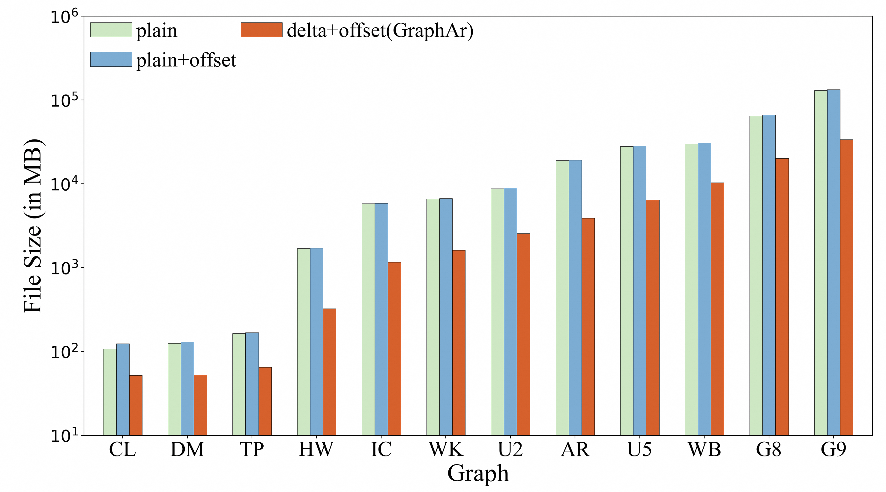
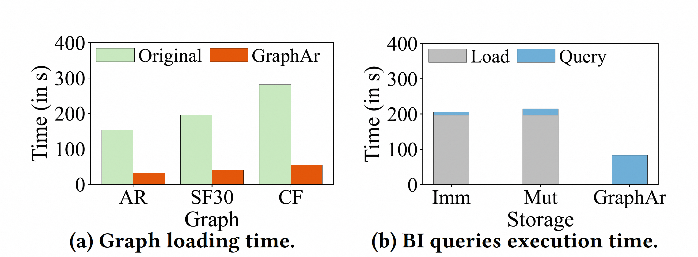
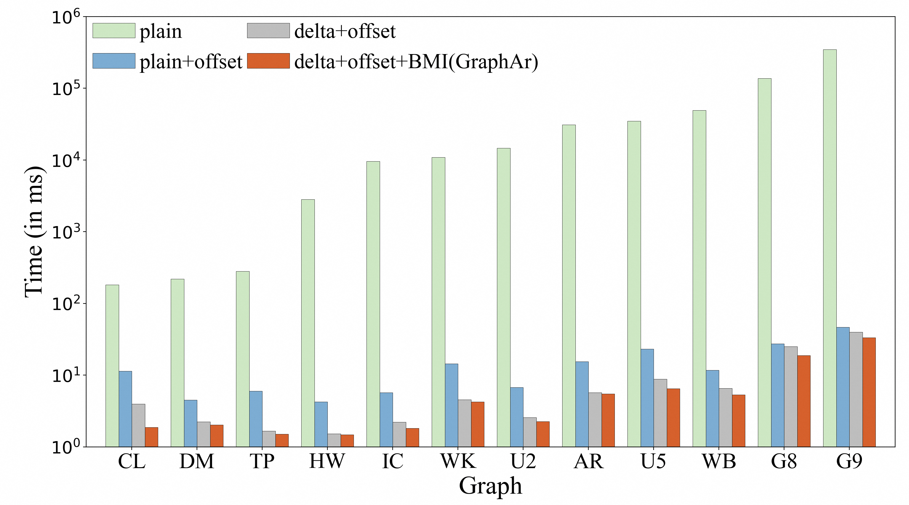
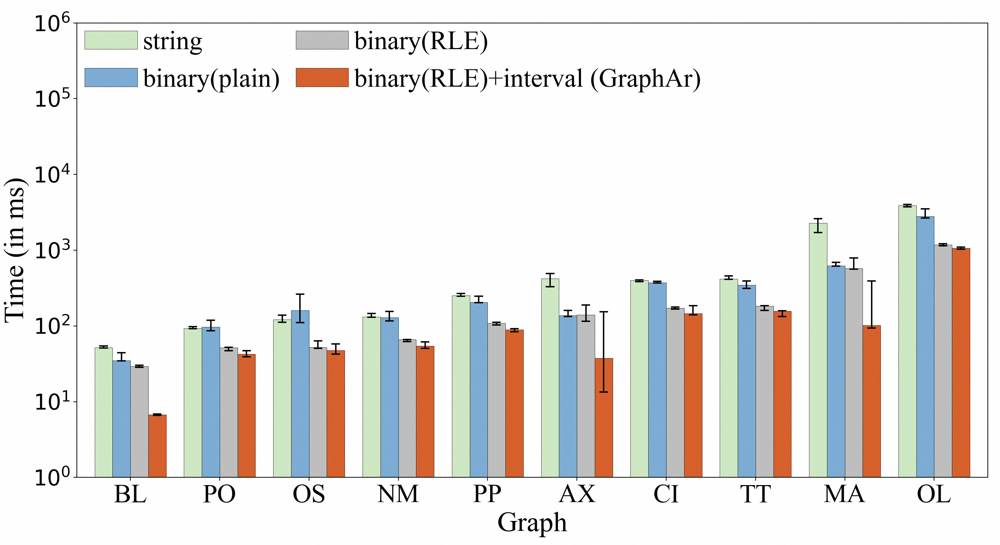
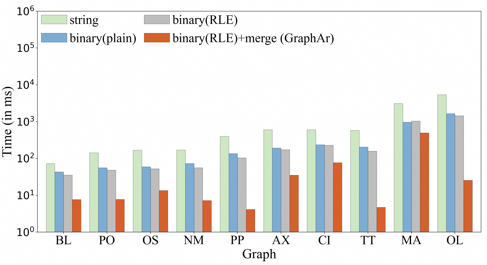

<h1 align="center" style="clear: both;">
    
</h1>
<p align="center">
    An open source, standard data file format for graph data storage and retrieval
</p>

[](https://github.com/apache/incubator-graphar/actions)
[](https://github.com/apache/incubator-graphar/actions)
[](https://codecov.io/gh/apache/incubator-graphar)
[](https://graphar.apache.org/docs/)
[](https://github.com/apache/incubator-graphar/issues?q=is%3Aopen+is%3Aissue+label%3A%22good+first+issue%22)
[](README-zh-cn.md)

## What is GraphAr?


Graph processing serves as the essential building block for a diverse
variety of real-world applications such as social network analytics,
data mining, network routing, and scientific computing.

GraphAr (short for "Graph Archive") is a project that aims to make it
easier for diverse applications and systems (in-memory and out-of-core
storages, databases, graph computing systems, and interactive graph
query frameworks) to build and access graph data conveniently and
efficiently.

It can be used for importing/exporting and persistent storage of graph
data, thereby reducing the burden on systems when working together.
Additionally, it can serve as a direct data source for graph processing
applications.

To achieve this, GraphAr project provides:

- The GraphAr format: a standardized system-independent
  format for storing graph data
- Libraries: a set of libraries for reading, writing and transforming
  GraphAr format data

By using GraphAr, you can:

- Store and persist your graph data in a system-independent way with the
  GraphAr format
- Easily access and generate GraphAr format data using the libraries
- Utilize Apache Spark to quickly manipulate and transform your graphar 
  format data

## The GraphAr Format

The GraphAr format is designed for storing property graphs. It uses
metadata to record all the necessary information of a graph, and
maintains the actual data in a chunked way.

A property graph consists of vertices and edges, with each vertex
contains a unique identifier and:

- A text label that describes the vertex type.
- A collection of properties, with each property can be represented by a
  key-value pair.

Each edge contains a unique identifier and:

- The outgoing vertex (source).
- The incoming vertex (destination).
- A text label that describes the relationship between the two vertices.
- A collection of properties.

The following is an example property graph containing two types of
vertices ("person" and "comment") and three types of edges.


### Vertices in GraphAr

#### Logical table of vertices

Each type of vertices (with the same type) constructs a logical vertex
table, with each vertex assigned with a global index inside this type
(called internal vertex id) starting from 0, corresponding to the row
number of the vertex in the logical vertex table. An example layout for
a logical table of vertices under the type "person" is provided for
reference.

Given an internal vertex id and the vertex type, a vertex is uniquely
identifiable and its respective properties can be accessed from this
table. The internal vertex id is further used to identify the source and
destination vertices when maintaining the topology of the graph.


###  Physical table of vertices

The logical vertex table will be partitioned into multiple continuous
vertex chunks for enhancing the reading/writing efficiency. To maintain
the ability of random access, the size of vertex chunks for the same
type is fixed. To support to access required properties avoiding
reading all properties from the files, and to add properties for
vertices without modifying the existing files, the columns of the
logical table will be divided into several column groups.

Take the `person` vertex table as an example, if the chunk size is set
to be 500, the logical table will be separated into sub-logical-tables
of 500 rows with the exception of the last one, which may have less than
500 rows. The columns for maintaining properties will also be divided
into distinct groups (e.g., 2 for our example). As a result, a total of
4 physical vertex tables are created for storing the example logical
table, which can be seen from the following figure.


> [!NOTE]
> For efficiently utilize the filter push-down of the payload
file format like Parquet, the internal vertex id is stored in the
payload file as a column. And since the internal vertex id is
continuous, the payload file format can use the delta encoding for the
internal vertex id column, which would not bring too much overhead for
the storage.

### Edges in GraphAr

#### Logical table of edges

For maintaining a type of edges (that with the same triplet of the
source type, edge type, and destination type), a logical edge table
is established. And in order to support quickly creating a graph from
the graph storage file, the logical edge table could maintain the
topology information in a way similar to [CSR/CSC](https://en.wikipedia.org/wiki/Sparse_matrix), that is, the
edges are ordered by the internal vertex id of either source or
destination. In this way, an offset table is required to store the start
offset for each vertex's edges, and the edges with the same
source/destination will be stored continuously in the logical table.

Take the logical table for `person knows person` edges as an example,
the logical edge table looks like:


#### Physical table of edges

As same with the vertex table, the logical edge table is also
partitioned into some sub-logical-tables, with each sub-logical-table
contains edges that the source (or destination) vertices are in the same
vertex chunk. According to the partition strategy and the order of the
edges, edges can be stored in GraphAr following one of the four types:

- **ordered_by_source**: all the edges in the logical table are ordered
  and further partitioned by the internal vertex id of the source, which
  can be seen as the CSR format.
- **ordered_by_dest**: all the edges in the logical table are ordered
  and further partitioned by the internal vertex id of the destination,
  which can be seen as the CSC format.
- **unordered_by_source**: the internal id of the source vertex is used
  as the partition key to divide the edges into different
  sub-logical-tables, and the edges in each sub-logical-table are
  unordered, which can be seen as the COO format.
- **unordered_by_dest**: the internal id of the destination vertex is
  used as the partition key to divide the edges into different
  sub-logical-tables, and the edges in each sub-logical-table are
  unordered, which can also be seen as the COO format.

After that, a sub-logical-table is further divided into edge chunks of a
predefined, fixed number of rows (referred to as edge chunk size).
Finally, an edge chunk is separated into physical tables in the
following way:

- an adjList table (which contains only two columns: the internal vertex
  id of the source and the destination).
- 0 or more edge property tables, with each table contains a group of
  properties.

Additionally, there would be an offset table for **ordered_by_source**
or **ordered_by_dest** edges. The offset table is used to record the
starting point of the edges for each vertex. The partition of the offset
table should be in alignment with the partition of the corresponding
vertex table. The first row of each offset chunk is always 0, indicating
the starting point for the corresponding sub-logical-table for edges.

Take the `person knows person` edges to illustrate. Suppose the vertex
chunk size is set to 500 and the edge chunk size is 1024, and the edges
are **ordered_by_source**, then the edges could be saved in the
following physical tables:


## Benchmark
Our experiments are conducted on an Alibaba Cloud r6.6xlarge instance, equipped with a
24-core Intel(R) Xeon(R) Platinum 8269CY CPU at 2.50GHz and
192GB RAM, running 64-bit Ubuntu 20.04 LTS. The data is hosted
on a 200GB PL0 ESSD with a peak I/O throughput of 180MB/s.
Additional tests on other platforms and S3-like storage yield similar
results.

### dataset 
Here we show statistics of datasets with hundreds of millions of vertices from [Graph500](https://graph500.org/) and [LDBC](https://doi.org/10.1145/2723372.2742786). Other datasets involved in the experiment can be found in  [paper](https://arxiv.org/abs/2312.09577).

<table>
    <thead>
        <tr>
            <th>Abbr.</th>
            <th>Graph</th>
            <th>|V|</th>
            <th>|E|</th>
        </tr>
    </thead>
    <tbody>
        <tr>
            <td>G8</td>
            <td>Graph500-28</td>
            <td>268M</td>
            <td>4.29B</td>
        </tr>
        <tr>
            <td>G9</td>
            <td>Graph500-29</td>
            <td>537M</td>
            <td>8.59B</td>
        </tr>
        <tr>
            <td>SF30</td>
            <td>SNB Interactive SF-30</td>
            <td>99.4M</td>
            <td>655M</td>
        </tr>
        <tr>
            <td>SF100</td>
            <td>SNB Interactive SF-100</td>
            <td>318M</td>
            <td>2.15B</td>
        </tr>
        <tr>
            <td>SF300</td>
            <td>SNB Interactive SF-300</td>
            <td>908M</td>
            <td>6.29B</td>
        </tr>
    </tbody>
</table>

<!-- We mainly conduct experiments from three aspects: Storage consumption, I/O efficiency and Query Time. -->

### Storage efficiency


Two baseline approaches are
considered: 1) “plain”, which employs plain encoding for the
source and destination columns, and 2) “plain + offset”, which
extends the “plain” method by sorting edges and adding an
offset column to mark each vertex’s starting edge position.
The result
is a notable storage advantage: on average, GraphAr requires
only 27.3% of the storage needed by the baseline “plain +
offset”, which is due to delta encoding.

### I/O speed


In (a) indicate that GraphAr significantly
outperforms the baseline (CSV), achieving an average speedup of 4.9×. In Figure (b), the immutable (“Imm”) and mutable (“Mut”) variants are two native in-memory storage of GraphScope. It demonstrates that although the querying time with GraphAr exceeds that of the in-memory storages, attributable to intrinsic I/O overhead, it significantly surpasses the process of loading and then
executing the query, by 2.4× and 2.5×, respectively. This indicates that GraphAr is a viable option for executing infrequent queries.


<!-- ### Neighbor Retrieval


We query vertices with the largest
degree in selected graphs, maintaining edges in CSR-like or CSC-like formats depending on the degree type. GraphAr significantly outperforms the baselines, achieving an average speedup of 4452× over the “plain” method, 3.05× over “plain + offset”, and 1.23× over “delta + offset”. -->
### Label Filtering


**Performance of simple condition filtering.**
For each graph, we perform experiments where we consider
each label individually as the target label for filtering.
GraphAr consistently outperforms the baselines. On average, it achieves a speedup of 14.8× over the “string” method, 8.9× over the “binary (plain)” method, and 7.4× over the  “binary (RLE)” method.



**Performance of complex condition filtering.**
For each graph,
we combine two labels by AND or OR as the filtering condition.
The merge-based decoding method yields the largest gain, where “binary (RLE) + merge” outperforms the “binary (RLE)” method by up to 60.5×.
<!-- ### Query efficiency
<table>
    <caption style="text-align: center;">Query Execution Times (in seconds)</caption>
    <thead>
        <tr>
            <th rowspan="2">Query</th>
            <th colspan="4" scope="colgroup">SF30</th>
            <th colspan="4" scope="colgroup">SF100</th>
            <th colspan="4" scope="colgroup">SF300</th>
        </tr>
        <tr>
            <th>P</th>
            <th>N</th>
            <th>A</th>
            <th>G</th>
            <th>P</th>
            <th>N</th>
            <th>A</th>
            <th>G</th>
            <th>P</th>
            <th>N</th>
            <th>A</th>
            <th>G</th>
        </tr>
    </thead>
    <tbody>
        <tr>
            <td>ETL</td>
            <td>6024</td>
            <td>390</td>
            <td>—</td>
            <td>—</td>
            <td>17726</td>
            <td>2094</td>
            <td>—</td>
            <td>—</td>
            <td>OM</td>
            <td>9122</td>
            <td>—</td>
            <td>—</td>
        </tr>
        <tr>
            <td>IS-3</td>
            <td>1.00</td>
            <td>0.30</td>
            <td>0.16</td>
            <td><strong>0.01</strong></td>
            <td>6.59</td>
            <td>2.09</td>
            <td>0.48</td>
            <td><strong>0.01</strong></td>
            <td>OM</td>
            <td>4.12</td>
            <td>1.39</td>
            <td><strong>0.03</strong></td>
        </tr>
        <tr>
            <td>IC-8</td>
            <td>1.35</td>
            <td><strong>0.37</strong></td>
            <td>72.2</td>
            <td>3.36</td>
            <td>8.43</td>
            <td><strong>1.26</strong></td>
            <td>246</td>
            <td>6.56</td>
            <td>OM</td>
            <td><strong>2.98</strong></td>
            <td>894</td>
            <td>23.3</td>
        </tr>
        <tr>
            <td>BI-2</td>
            <td>125</td>
            <td>45.0</td>
            <td>67.7</td>
            <td><strong>4.30</strong></td>
            <td>3884</td>
            <td>1101</td>
            <td>232</td>
            <td><strong>16.3</strong></td>
            <td>OM</td>
            <td>6636</td>
            <td>756</td>
            <td><strong>50.0</strong></td>
        </tr>
    </tbody>
</table>
<p><strong>Notes: <a href="https://github.com/apache/pinot" target="_blank">Pinot (P)</a>, <a href="https://github.com/neo4j/neo4j" target="_blank">Neo4j (N)</a>, <a href="https://arrow.apache.org/docs/cpp/streaming_execution.html" target="_blank">Acero (A)</a>, and GraphAr (G).
“OM” denotes failed execution due to out-of-memory errors. 
While both Pinot and Neo4j are widely-used, they
are not natively designed for data lakes and require an Extract-Transform-Load (ETL) process for integration. The three representative queries includes neighbor retrieval and label filtering, reference to <a href="https://github.com/ldbc/ldbc_snb_bi" target="_blank">LDBC SNB Business Intelligence</a> and <a href="https://github.com/ldbc/ldbc_snb_interactive_v1_impls" target="_blank">LDBC SNB Interactive v1 </a> workload implementations. </strong></p>

GraphAr significantly outperforms Acero, achieving an
average speedup of 29.5×. A closer analysis of the results reveals
that the performance gains stem from the following factors: 1) data
layout design and encoding/decoding optimizations we proposed,
to enable efficient neighbor retrieval (IS-3, IC-8, BI-2) and label
filtering (BI-2); 2) bitmap generation can be utilized in selection steps (IS-3, IC-8, BI-2). -->

## Libraries

GraphAr offers a collection of libraries for the purpose of reading,
writing and transforming files. Currently, the following libraries are
available, and plans are in place to expand support to additional
programming language.

### The C++ Library

See [GraphAr C++
Library](./cpp) for
details about the building of the C++ library.


### The Scala with Spark Library

See [GraphAr Spark
Library](./maven-projects/spark)
for details about the Scala with Spark library.

### The Java-FFI Library

> [!WARNING] 
> The Java-FFI library is no longer being updated. The final version depends on C++ library v0.12.0.

The GraphAr Java library was created with bindings to the C++ library
(currently at version v0.12.0), utilizing
[Alibaba-FastFFI](https://github.com/alibaba/fastFFI) for
implementation. See [GraphAr Java Library](./maven-projects/java) for
details about the building of the Java library.

### The Java Library
> [!NOTE]
> The Java library is under development.

The Java library is composed of different modules:
- **[java-info](./maven-projects/info)**: Responsible for parsing graphInfo (schema) from YAML files
- **java-io-xxx**: Responsible for reading graph data from different storage formats (to be implemented)
- **java-api-xxx**: Provides high level API for graph operations (to be implemented)

This module is part of the pure Java implementation of GraphAr, which is currently under development.

### The Python with PySpark Library

> [!NOTE] 
> The Python with PySpark library is under development.

The PySpark library is developed as bindings to the GraphAr
Spark library. See [GraphAr PySpark
Library](./pyspark) for details about the PySpark library.

## Contributing

- Start with [Contributing Guide](https://github.com/apache/incubator-graphar/blob/main/CONTRIBUTING.md).
- Submit [Issues](https://github.com/apache/incubator-graphar/issues) for bug reports, feature requests.
- Discuss at [dev mailing list](mailto:dev@graphar.apache.org) ([subscribe](mailto:dev-subscribe@graphar.apache.org?subject=(send%20this%20email%20to%20subscribe)) / [unsubscribe](mailto:dev-unsubscribe@graphar.apache.org?subject=(send%20this%20email%20to%20unsubscribe)) / [archives](https://lists.apache.org/list.html?dev@graphar.apache.org)).
- Asking questions on [GitHub Discussions](https://github.com/apache/graphar/discussions/new?category=q-a).

## License

**GraphAr** is distributed under [Apache License
2.0](https://github.com/apache/incubator-graphar/blob/main/LICENSE).
Please note that third-party libraries may not have the same license as
GraphAr.

## Publication

- Xue Li, Weibin Zeng, Zhibin Wang, Diwen Zhu, Jingbo Xu, Wenyuan Yu, Jingren Zhou. GraphAr: An Efficient Storage Scheme for Graph Data in Data Lakes. PVLDB, 18(3): 530 - 543, 2024.

```bibtex
@article{li2024graphar,
  author = {Xue Li and Weibin Zeng and Zhibin Wang and Diwen Zhu and Jingbo Xu and Wenyuan Yu and Jingren Zhou},
  title = {GraphAr: An Efficient Storage Scheme for Graph Data in Data Lakes},
  journal = {Proceedings of the VLDB Endowment},
  year = {2024},
  volume = {18},
  number = {3},
  pages = {530--543},
  publisher = {VLDB Endowment},
}
```

The source code, data, and/or other artifacts of the research paper have been made available at the [research branch](https://github.com/apache/incubator-graphar/tree/research).
