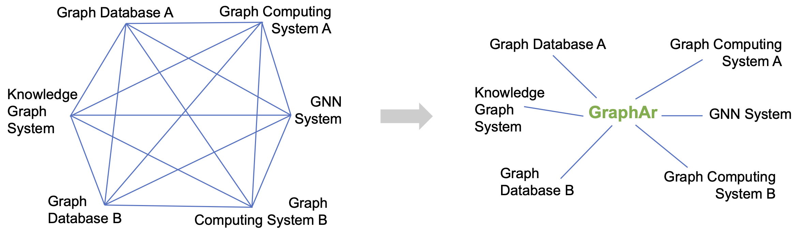

GraphAr is a project to standardize the graph data format and provide a set of libraries to generate, access and transform such formatted files.

It is intended to serve as the standard file format for importing/exporting and persistent storage of the graph data which can be used by diverse existing systems, reducing the overhead when various systems co-work.

Additionally, it can also serve as the direct data source for graph processing applications.

### [Motivation](/docs/overview/motivation)

### [Concepts](/docs/overview/concepts)
