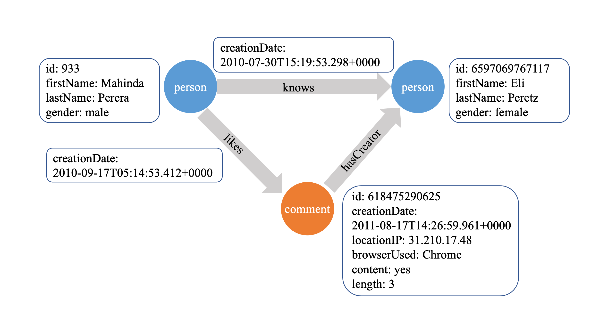
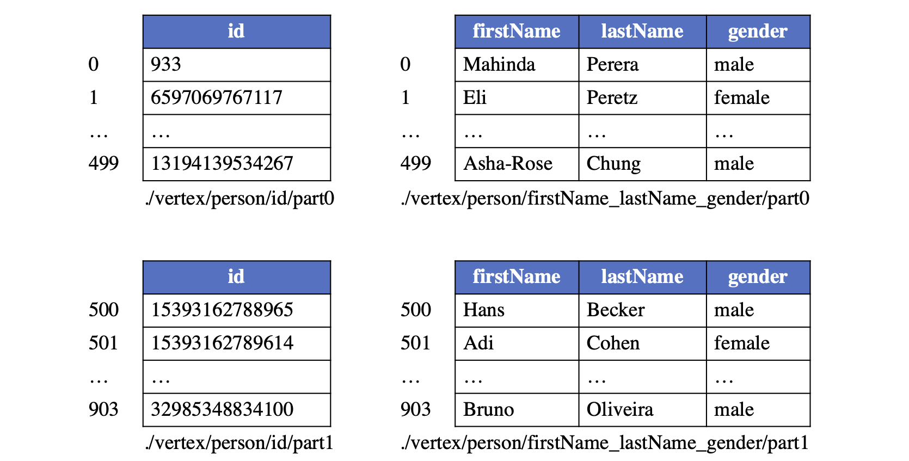
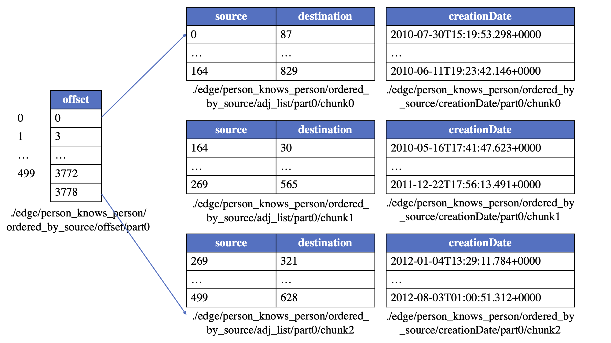
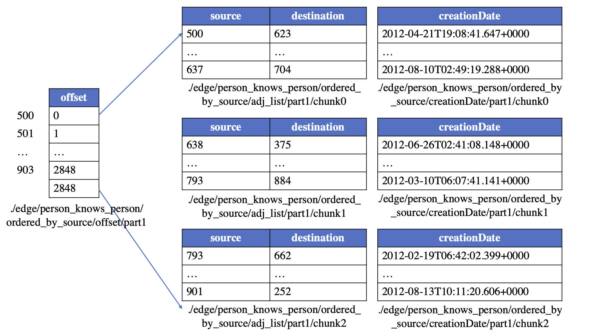

## Property Graph

GraphAr is designed for representing and storing the property graphs. Graph (in discrete mathematics) is a structure made of vertices and edges.
Property graph is then a type of graph model where the vertices/edges could carry a name (also called as type or label) and some properties.
Since carrying additional information than non-property graphs, the property graph is able to represent
connections among data scattered across diverse data databases and with different schemas.
Compared with the relational database schema, the property graph excels at showing data dependencies.
Therefore, it is widely-used in modeling modern applications including social network analytics, data mining,
network routing, scientific computing and so on.

A property graph consists of vertices and edges, with each vertex contains a unique identifier and:

- A text label that describes the vertex type.
- A collection of properties, with each property can be represented by a key-value pair.

Each edge contains a unique identifier and:

- The outgoing vertex (source).
- The incoming vertex (destination).
- A text label that describes the relationship between the two vertices.
- A collection of properties.

The following is an example property graph containing two types of vertices ("person" and "comment") and three types of edges.

## Property Data Types

GraphAr support a set of built-in property data types that are common in real use cases and supported by most file types (CSV, ORC, Parquet), includes:

- **Boolean**
- **Int32**: Integer with 32 bits
- **Int64**: Integer with 64 bits
- **Float**: 32-bit floating point values
- **Double**: 64-bit floating point values
- **String**: Textual data
- **Date**: days since the Unix epoch
- **Timestamp**: milliseconds since the Unix epoch
- **Time**: milliseconds since midnight
- **List**: A list of values of the same type

GraphAr also supports the user-defined data types, which can be used to represent complex data structures,
such as the struct, map, and union types.

## Configurations

### Vertex Chunk Size

The vertex chunk size is a configuration parameter that determines the number of vertices in a vertex chunk
and used to partition the logical vertex table into multiple physical vertex tables.

The vertex chunk size should be set to a value that is large enough to reduce the overhead of reading/writing files,
but small enough to avoid reading/writing too many vertices at once. We recommend setting the vertex chunk size to
empirical value 2^18 (262,144) for most cases.

### Edge Chunk Size

The edge chunk size is a configuration parameter that determines the number of edges in an edge chunk
and used to partition the logical edge table into multiple physical edge tables.

The edge chunk size should be set to a value that is large enough to reduce the overhead of reading/writing files,
but small enough to avoid reading/writing too many edges at once. We recommend setting the edge chunk size to
empirical value 2^22 (4,194,304) for most cases.

### Data File Format

GraphAr supports multiple file formats for storing the actual data of vertices and edges,
including Apache ORC, Apache Parquet, CSV, and JSON.

The file format should be chosen based on the specific use case and the data processing framework that will be used to
process the graph data. For example, if the graph data will be processed using Apache Spark,
then the Apache Parquet file format is recommended.

## Adjacency List Type

Adjacency list is a data structure used to represent the edges of a graph. GraphAr supports multiple types of adjacency lists for a given group of edges, including:

- **ordered_by_source**: all the edges in the logical table are ordered and further partitioned by the internal vertex id of the source, which can be seen as the CSR format.
- **ordered_by_dest**: all the edges in the logical table are ordered and further partitioned by the internal vertex id of the destination, which can be seen as the CSC format.
- **unordered_by_source**: the internal id of the source vertex is used as the partition key to divide the edges into different sub-logical-tables, and the edges in each sub-logical-table are unordered, which can be seen as the COO format.
- **unordered_by_dest**: the internal id of the destination vertex is used as the partition key to divide the edges into different sub-logical-tables, and the edges in each sub-logical-table are unordered, which can also be seen as the COO format.

## Vertex Chunks in GraphAr

### Logical table of vertices

Each type of vertices (with the same label) constructs a logical vertex table, with each vertex assigned with a global index inside this type (called internal vertex id) starting from 0, corresponding to the row number of the vertex in the logical vertex table. An example layout for a logical table of vertices under the label "person" is provided for reference.

Given an internal vertex id and the vertex label, a vertex is uniquely identifiable and its respective properties can be accessed from this table. The internal vertex id is further used to identify the source and destination vertices when maintaining the topology of the graph.

:::note

In the logical vertex table, some property can be marked as the primary key, such as the "id" column of the "person" table.

:::

### Physical table of vertices

The logical vertex table will be partitioned into multiple continuous vertex chunks for enhancing the reading/writing efficiency. To maintain the ability of random access, the size of vertex chunks for the same label is fixed. To support to access required properties avoiding reading all properties from the files, and to add properties for vertices without modifying the existing files, the columns of the logical table will be divided into several column groups.

Take the "person" vertex table as an example, if the chunk size is set to be 500, the logical table will be separated into sub-logical-tables of 500 rows with the exception of the last one, which may have less than 500 rows. The columns for maintaining properties will also be divided into distinct groups (e.g., 2 for our example). As a result, a total of 4 physical vertex tables are created for storing the example logical table, which can be seen from the following figure.

:::note

For efficiently utilize the filter push-down of the payload file format like Parquet, the internal vertex id is stored in the payload file as a column. And since the internal vertex id is continuous, the payload file format can use the delta encoding for the internal vertex id column, which would not bring too much overhead for the storage.

:::

## Edge Chunks in GraphAr

### Logical table of edges

For maintaining a type of edges (that with the same triplet of the source label, edge label, and destination label), a logical edge table is established.  And in order to support quickly creating a graph from the graph storage file, the logical edge table could maintain the topology information in a way similar to CSR/CSC (learn more about [CSR/CSC](https://en.wikipedia.org/wiki/Sparse_matrix)), that is, the edges are ordered by the internal vertex id of either source or destination. In this way, an offset table is required to store the start offset for each vertex's edges, and the edges with the same source/destination will be stored continuously in the logical table.

Take the logical table for "person likes person" edges as an example, the logical edge table looks like:

### Physical table of edges

As same with the vertex table, the logical edge table is also partitioned into some sub-logical-tables, with each sub-logical-table contains edges that the source (or destination) vertices are in the same vertex chunk. According to the partition strategy and the order of the edges, edges can be stored in GraphAr following the setting adjacency list type.

After that, the whole logical table of edges will be divided into multiple sub-logical-tables with each sub-logical-table contains edges that the source (or destination) vertices are in the same vertex chunk. Then, a sub-logical-table is further divided into edge chunks of a predefined, fixed number of rows (referred to as edge chunk size). Finally, an edge chunk is separated into physical tables in the following way:

- an adjList table (which contains only two columns: the internal vertex id of the source and the destination).
- 0 or more property group tables (each contains the properties of the edges).

Additionally, there would be an offset table for **ordered_by_source** or **ordered_by_dest** edges. The offset table is used to record the starting point of the edges for each vertex. The partition of the offset table should be in alignment with the partition of the corresponding vertex table. The first row of each offset chunk is always 0, indicating the starting point for the corresponding sub-logical-table for edges.

Take the "person knows person" edges to illustrate. Suppose the vertex chunk size is set to 500 and the edge chunk size is 1024, and the edges are **ordered_by_source**, then the edges could be saved in the following physical tables:

> **Tip:** When the edge type is **ordered_by_source**, the sorted adjList table together with the offset table can be used as CSR, supporting the fast access of the outgoing edges for a given vertex. Similarly, a CSC view can be constructed by sorting the edges by destination and recording corresponding offsets, supporting the fast access of the incoming edges for a given vertex.

## Information files

GraphAr uses two kinds of files to store a graph: a group of Yaml files to describe metadata information; and data files to store actual data for vertices and edges.  
A graph information file which named "\<name\>.graph.yml" describes the meta information for a graph whose name is \<name\>. The content of this file includes:

- the graph name;
- the root directory path of the data files;
- the vertex information and edge information files included;
- the version of GraphAr.
- extra information for the graph, could be used for user defined information.

A vertex information file which named "\<label\>.vertex.yml" defines a single group of vertices with the same vertex label \<label\>, and all vertices in this group have the same schema. The file defines:

- the vertex label;
- the vertex chunk size;
- the relative path for vertex data files;
- the property groups attached: each property group has its own file type and the prefix for the path of its data files, it also lists all properties in this group, with every property containing its own name, data type, flagging of whether it is the primary key or not and flagging of whether it is nullable or not for non-primary key properties;
- the version of GraphAr.

An edge information file which named "\<source label\>_\<edge label\>_\<destination label\>.edge.yml" defines a single group of edges with specific label for source vertex, destination vertex and the edge. It describes the meta information for these edges, includes:

- the source/edge/destination labels;
- the edge chunk size, the source vertex chunk size and the destination vertex chunk size;
- if the edges are directed or not;
- the relative path for edge data files;
- which kinds of adjList it includes: for each kind of adjList, the adjList type, the prefix of file path, the file type;
- the property groups attached to the edge for all adjLists;
- the version of GraphAr.

:::note

Please note that GraphAr supports the storage of multiple types of adjLists for a given group of edges, e.g., a group of edges could be accessed in both CSR and CSC way when two copies (one is **ordered_by_source** and the other is **ordered_by_dest**) of the relevant data are present in GraphAr.

:::

See also [Gar Information Files](https://graphar.apache.org/docs/libraries/cpp/getting-started#gar-information-files) for an example.

## Data files

As previously mentioned, each logical vertex/edge table is divided into multiple physical tables stored in one of the following file formats:

- [Apache ORC](https://orc.apache.org/)
- [Apache Parquet](https://parquet.apache.org/)
- CSV
- JSON

Both of Apache ORC and Apache Parquet are column-oriented data storage formats. In practice of graph processing, it is common to only query a subset of columns of the properties. Thus, the column-oriented formats are more efficient, which eliminate the need to read columns that are not relevant. They are also used by a large number of data processing frameworks like [Apache Spark](https://spark.apache.org/), [Apache Hive](https://hive.apache.org/), [Apache Flink](https://flink.apache.org/), and [Apache Hadoop](https://hadoop.apache.org/).

See also [GraphAr Data Files](https://graphar.apache.org/docs/libraries/cpp/getting-started#gar-data-files) for an example.

## Implementation

The GraphAr libraries may implement part of the GraphAr format. The implementation status of the GraphAr libraries can refer to the [GraphAr implementation status](implementation-status.md).
